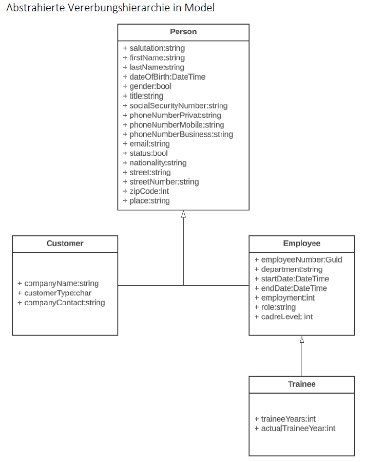

[](https://github.com/ZbW-Projects/ContactManager/actions/workflows/ci.yml)

# ContactManager
Diese App wird von drei Entwicklern im Rahmen eines Semesterprojekts an der ZbW entwickelt.</br>
Als Architektur wird MVC (Model View Controller) implementiert.</br>
Die folgenden Schichten beinhalten:</br>
- **Model:** Object Oriented Design 
- **Controller:** Use Cases / Add On's
- **View:** Windows Forms als UI
- **Data:** Holt die Daten lokal.

---
## Gruppenmitglieder 
Eduard Anderegg ( Plannung / Development )</br>
Nadine Untersee ( UI/UX Development )</br>
Joël Rohner ( Unit Testing / Testing )</br>

---
## Aufbau

### Contact Manager nach MVC Architektur


### The Model Design (OOD) als Diagram


### User Stories (ohne Login / Auth) für Use Cases
| **ID**| **User Story**                                                                                                                                                                                       | **Rolle (zukünftig)** |      **Kategorie**               |
| ----- | ----------------------------------------------------------------------------------------------------------------------------------------- | ---------------------  | --------------------------- |
| CM-01 | Als Benutzer möchte ich eine Liste aller Kontakte anzeigen, damit ich die verfügbaren Personen durchsuchen kann.                    | Alle                            | Auflistung/Suche             |
| CM-02 | Als Benutzer möchte ich Kontakte nach Name, Firma oder ID suchen, um Personen schnell zu finden.                                          | Alle                            | Auflistung/Suche             |
| CM-03 | Als Benutzer möchte ich ein neues Mitarbeiterprofil erstellen, um Personal dem System hinzuzufügen.                                         | Admin                       | Erstellung                          |
| CM-04 | Als Benutzer möchte ich eine/n neue/n Lernende/n erfassen, damit diese/r in unseren Kontaktdaten enthalten ist.                      | Admin                       | Erstellung                          |
| CM-05 | Als Benutzer möchte ich einen neuen Kundenkontakt hinzufügen, um externe Beziehungen zu pflegen.                                      | Admin                       | Erstellung                         |
| CM-06 | Als Benutzer möchte ich Kontaktdaten (E-Mail, Telefon, Adresse) bearbeiten können, damit die Daten aktuell bleiben.                 | Admin                       | Bearbeitung                      |
| CM-07 | Als Benutzer möchte ich einen Kontakt deaktivieren können, damit dieser nicht mehr in der aktiven Liste erscheint.                     | Admin                       | Deaktivierung                    |
| CM-08 | Als Benutzer möchte ich deaktivierte Kontakte einsehen.                                                                                                                  | Alle                           | Deaktivierung                     |
| CM-09 | Als Benutzer möchte ich, dass das System eindeutige Mitarbeiter-/Kundennummern generiert, damit die Nachverfolgung einfach ist. | System            | ID/Konsistenz                     |
| CM-10 | Als Benutzer möchte ich Notizen oder Interaktionen mit Kontakten erfassen, damit die Kundenhistorie nachvollziehbar ist.         | Admin                      | Protokoll/Notizen              |
| CM-11 | Als Benutzer möchte ich die Protokollhistorie eines Kontakts einsehen, um kürzliche Interaktionen nachzuvollziehen.                  | Alle                           | Protokoll/Notizen              |
| CM-12 | Als Benutzer möchte ich die Gesamtzahl an Mitarbeitenden, Lernenden und Kunden sehen, um einen schnellen Überblick zu erhalten. | Alle                | Reporting (Optional)         |
| CM-13 | Als Benutzer möchte ich Kontaktdaten als CSV exportieren / importieren können, um sie extern weiterzugeben oder zu analysieren. | Admin     | Export/Import Add on (Optional)|


---
## Development

Vor dem Pushen des Codes im Repo ist Refactoring des Codes erforderlich.
```csharp
dotnet format ./ContactManager.sln
```

### Snippets
Das Projekt hat einen Snippet-Ordner. Darunter sind Snippets zu finden, die für `Visual Studio`
installiert werden können.

#### Integration
1. In Visual Studio unter: `Tools` => `Code Snippets Manager...`
2. `C#` Auswählen
3. `Import` clicken
4. `.snippet` file auswählen
5. Ein Ordner auswählen, wie `My Code Snippets` => `Bestätigen`
#### Anwenden
In einem `C# file`</br>
- Kürzel eintippen. Als beispiel: `gss`
- `Tab`  => Name der Klasse eingeben => nochmal `Tab` drücken; Typ eingeben

